## Button basics

Button switches are an **input**. The button sends a signal which is received by the Raspberry Pi to be processed.


The **LEDs, buzzers, and Scratch games** project used a Raspberry Pi as a powerful general purpose input output (GPIO) pins to control simple electronic **outputs** such as LEDs and buzzers. In this project, you will do the same for **inputs** with the humble button switch.

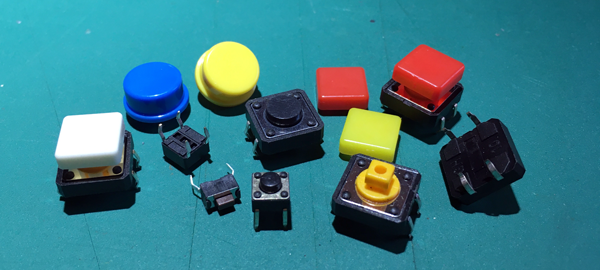

Many switches **toggle** between `on` and `off`— household light switches are a key example. All of the button switches in the image above, and the ones you'll look at in this project are **push-to-make** switches, which means that they are `on` while they being pressed and `off` whenever they are not being pressed.

### Button switch leg connections

All but the smallest buttons have four legs which are connected in signal in and signal out pairs (polarity does not matter for button switches).

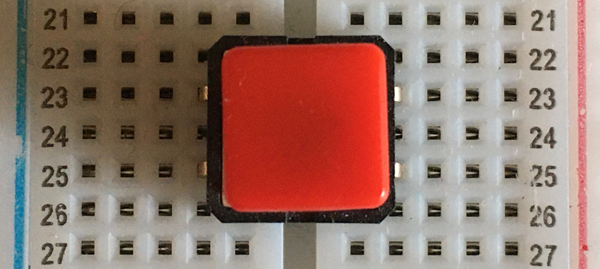

In the image above, a **signal in** jumper cable could be connected anywhere in row 23 and the **signal out** cable anywhere in row 25.

NOTE: if you connected a cable to the left-hand side row 23 and another to the right-hand side of row 23, the signal would pass straight through the switch whether it was pressed or not.

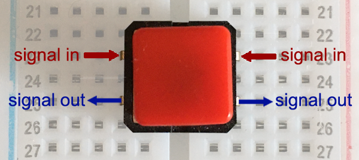

### A simple button setup

--- task ---

Plug a button switch into your breadboard. The button switch fits nicely with its legs spread across the middle trench in the breadboard.

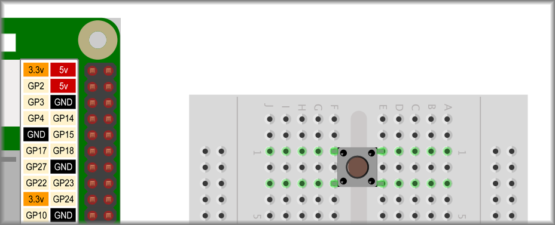

--- /task ---

--- task ---

Connect one leg (signal in) to a numbered GPIO pin. In the example, it is connected to **GPIO pin 2**.

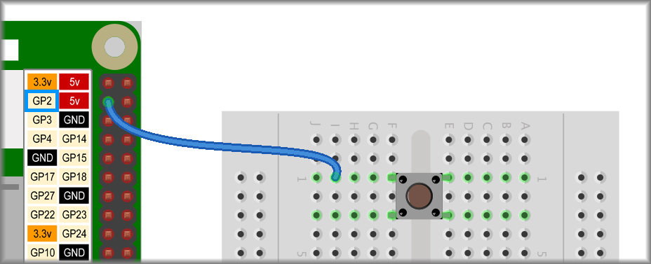

--- /task ---

--- task ---

Connect the other leg on that side (signal out) to a ground (GND or -) pin.

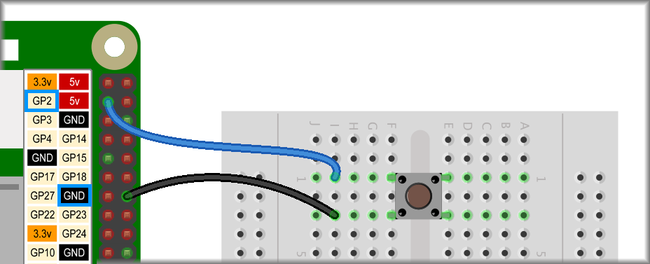

--- /task ---

### Scratch controlled by the button

--- task ---

Select Scratch 3 from your Raspberry Pi menu.

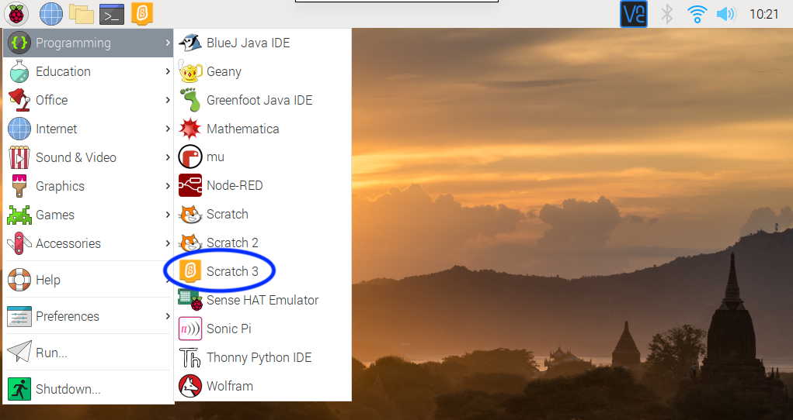

--- /task ---

For the button to send an input to your Raspberry Pi through the GPIO pin, you need to add a Scratch extension.

--- task ---

Click on the **Add Extension** button on the bottom left-hand corner.

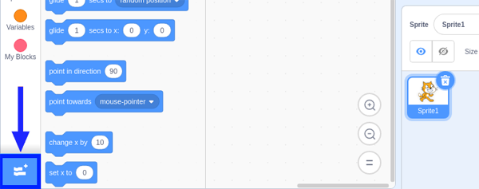

Scroll down to the bottom to find three Raspberry Pi extensions.

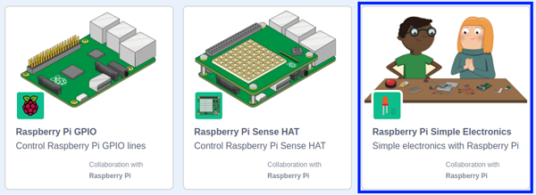

Choose the **Raspberry Pi Simple Electronics** extension. When you click this, a new palette of coding blocks becomes available.


--- /task ---

--- task ---

You would usually start with an **event** from the `Events`{:class="block3events"} palette to start your code, such as `when flag clicked`{:class="block3events"}, but the `Raspberry Pi Simple Electronics`{:class="block3extensions"} palette has an event of its own.

Pick the `when button 0 is pressed`{:class="block3extensions"} block.

```blocks3
when button (0 v) is [pressed v] ::hat extension
```

--- /task ---

--- task ---

Change the button number to 2 (or whatever GPIO pin you used to connect your button switch) and add any effect you like, or follow the example below.

```blocks3
when button (2 v) is [pressed v] ::hat extension
set size to (300) %
```

If you like, you could add a few different effects, like below.

```blocks3
when button (2 v) is [pressed v] ::hat extension
set size to (300) %
set [color v] effect to (60)
set [whirl v] effect to (350)
```

Press the button and see what happens to Scratch cat.

--- no-print ---
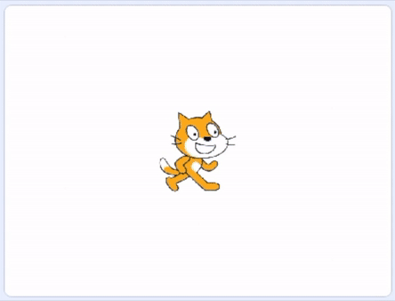
--- /no-print ---

--- print-only ---
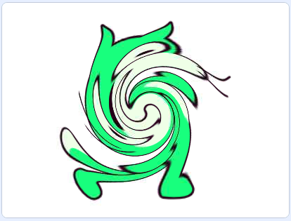
--- /print-only ---

--- /task ---

You can also use the button release **event** to set Scratch cat back to normal.

--- task ---

Duplicate the code you just made, set the `button pressed`{:class="block3extensions"} event to `button released`{:class="block3extensions"}, set `size`{:class="block3looks"} to 100%, and `color`{:class="block3looks"} and `whirl`{:class="block3looks"} to 0.

```blocks3
when button (2 v) is [released v] ::hat extension
set size to (100) %
set [color v] effect to (0)
set [whirl v] effect to (0)
```

Press and release the button to check that it works as you expect.

--- no-print ---
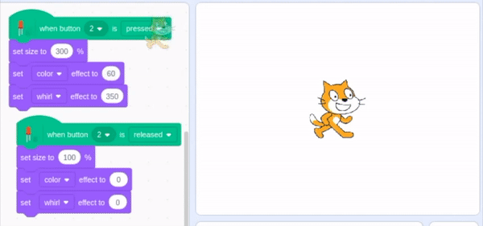
--- /no-print ---

--- print-only ---
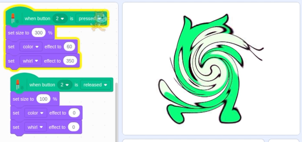
--- /print-only ---

--- /task ---

Another option is to use the **SPACE** key as an effect to reset `event`{:class="block3events"} instead of the `button released`{:class="block3extensions"} event, and swap the `when button pressed`{:class="block3extensions"} `set`{:class="block3looks"} effects to `change`{:class="block3looks"} effects.

Let's try it out!

--- task ---

First, replace `when button released`{:class="block3extensions"} with `when space pressed`{:class="block3events"}.

```blocks3
when [space v] key pressed
set size to (100) %
set [color v] effect to (0)
set [whirl v] effect to (0)
```
--- /task ---

--- task ---

Next, under the `when button pressed`{:class="block3extensions"} code, replace each of the `set`{:class="block3looks"} blocks with `change`{:class="block3looks"} blocks.

```blocks3
when button (2 v) is [pressed v] ::hat extension
change size by (50) %
change [color v] effect by (10)
change [whirl v] effect by (50)
```

Press the button a few times and see what happens.

--- no-print ---
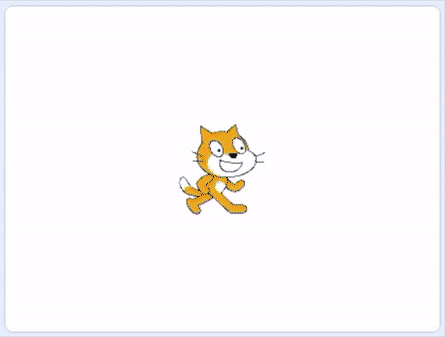
--- /no-print ---

--- print-only ---
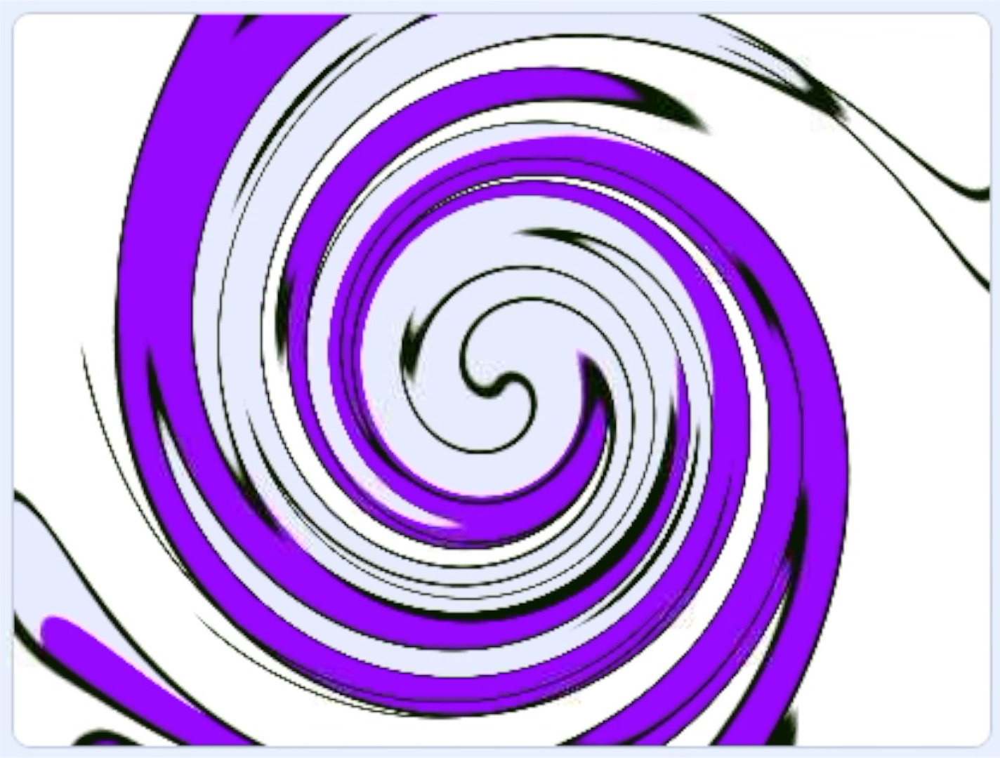
--- /print-only ---

--- /task ---
