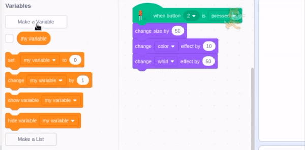
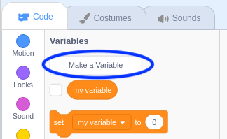
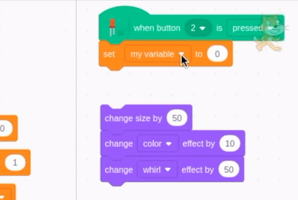
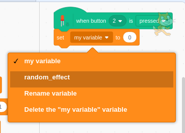

## A random button

Looking at the example code from **button basics**, there are three different effects happening all at the same time: 

+ size 
+ colour
+ whirl

```blocks3
when button (2 v) is [pressed v] ::hat extension
change size by (50) %
change [color v] effect by (10)
change [whirl v] effect by (50)

when [space v] key pressed
set size to (100) %
set [color v] effect to (0)
set [whirl v] effect to (0)
```

Now you're going to use **selection** and a variable to make only one of these things happen each time you press the button.

The `when space pressed`{:class="block3events"} code remains unchanged as this is the reset code.

--- task ---

Make a new variable and name it `random_effect`{:class="block3variables"}.

--- no-print ---

--- /no-print ---

--- print-only ---

--- /print-only ---

--- /task ---

--- task ---

Disconnect the `change`{:class="block3looks"} blocks from the `when button pressed`{:class="block3extensions"} event block and move them to one side.

```blocks3
when button (2 v) is [pressed v] ::hat extension

change size by (50) %
change [color v] effect by (10)
change [whirl v] effect by (50)
```

--- /task ---

--- task ---

Under your `when button pressed`{:class="block3extensions"} event, add a `set my variable to 0`{:class="block3variables"} block.

Use the drop-down box to change the variable to `random_effect`{:class="block3variables"}.

--- no-print ---

--- /no-print ---

--- print-only ---

--- /print-only ---

--- /task ---

--- task ---

From the `Operators`{:class="block3operators"} block palette, add a `pick random 1 to 10`{:class="block3operators"} block and change the range to 1 to 3.

```blocks3
when button (2 v) is [pressed v] ::hat extension
+ set [random_effect v] to (pick random (1) to (3))
```
Now, every time you press the button, `random_effect`{:class="block3variables"} is set to 1, 2, or 3.

--- /task ---

### About selection

At this point in the code, you need the program to make a **decision**. You need it to decide which of the three effects is going to happen each time the button is pressed. We call this decidion a **selection**.

The program asks a question, checks the answer and then proceeds one way or another depending on the answer. The answer to a selection question can only be **true** or **false**.

**Question:** Does `random_effect`{:class="block3variables"} equal `1`{:class="block3variables"}?

The answer is either **true** (yes, `random_effect`{:class="block3variables"} equals `1`{:class="block3variables"}) 
or **false** (no, `random_effect`{:class="block3variables"} does **not** equal `1`{:class="block3variables"}). There are no other options.

`If`{:class="block3control"} it is 1, then the program will do one thing, `else`{:class="block3control"} (otherwise) it will something else.

Let's add some selection to your program.

--- task ---

From the `Control`{:class="block3control"} block palette, add an `if... then... else`{:class="block3control"} block.

```blocks3
when button (2 v) is [pressed v] ::hat extension
set [random_effect v] to (pick random (1) to (3))
+ If <> then
else
end
```

--- /task ---

Now, you are going to add the **condition** to be checked.

--- task ---

From the `Operators`{:class="block3operators"} block palette, add a `0 = 50`{:class="block3control"} block and change the 50 to 1, and add the `random_effect`{:class="block3variables"} block into the blank value field.

```blocks3
<(random_effect)=(1)>
```

Place this whole block in the hexagonal space between `if`{:class="block3control"} and `then`{:class="block3control"}.

```blocks3
when button (2 v) is [pressed v] ::hat extension
set [random_effect v] to (pick random (1) to (3))
If <(random_effect)=(1)> then
else
end
```

--- /task ---

--- task ---

If `random_effect`{:class="block3variables"} does equal 1 then let's change the size.

```blocks3
when button (2 v) is [pressed v] ::hat extension
set [random_effect v] to (pick random (1) to (3))
If <(random_effect)=(1)> then
    change size by (50) %
else
end
```

--- /task ---

But if `random_effect`{:class="block3variables"} does **not** equal 1, you need the program to check if it equals 2!

--- task ---

Duplicate the `if... then... else`{:class="block3control"} block along with everything inside it.

Change the `random_effect`{:class="block3variables"}`= 1`{:class="block3operators"}to `random_effect`{:class="block3variables"}`= 2`{:class="block3operators"} and throw the duplicated `change size`{:class="block3looks"} block away.

```blocks3
If <(random_effect)=(2)> then
else
end
```

Place this new `if... then... else`{:class="block3control"} block **inside** the `else`{:class="block3control"} part of the original `if... then... else`{:class="block3control"} block.

```blocks3
when button (2 v) is [pressed v] ::hat extension
set [random_effect v] to (pick random (1) to (3))
If <(random_effect)=(1)> then
    change size by (50) %
else
+   If <(random_effect)=(2)> then
    else
    end
end
```

--- /task ---

--- task ---
If `random_effect`{:class="block3variables"} does equal 2, then change the colour.

```blocks3
change [color v] effect by (20)
```

If `random_effect`{:class="block3variables"} does **not** equal 1 or 2, then then it **must** equal 3, so in the second `else`{:class="block3control"} section let's change the whirl effect.

```blocks3
change [whirl v] effect by (50)
```

--- /task ---

--- task ---

It took two questions to check whether `random_effect`{:class="block3variables"} is 1, 2, or 3.

```blocks3
when button (2 v) is [pressed v] ::hat extension
set [random_effect v] to (pick random (1) to (3))
If <(random_effect)=(1)> then
    change size by (50) %
else
    If <(random_effect)=(2)> then
+       change [color v] effect by (20)
    else
+       change [whirl v] effect by (50)
    end
end
```

Now press the button a few times to see what effect will happen each time.

--- /task ---


