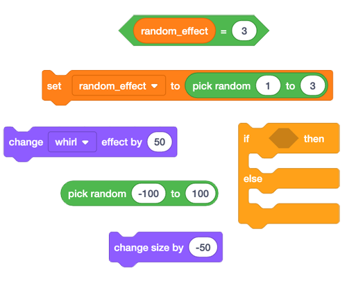

## Challenge: a more random button

Add to, and edit, the code from **A random button** so that there is a fourth random option **and** also that the whirl effect changes a random amount so that it can whirl in either direction.

The fourth random option will be shrinking.

--- no-print ---


--- /no-print ---

--- print-only ---


--- /print-only ---

Start with the [code](http://rpf.io/p/en/button-switch-scratch-pi-get){:target="_blank"} from [a random button](http://rpf.io/p/en/button-switch-scratch-pi-get){:target="_blank"}.

```blocks3
when button (2 v) is [pressed v] ::hat extension
set [random_effect v] to (pick random (1) to (3))
If <(random_effect)=(1)> then
    change size by (50) %
else
    If <(random_effect)=(2)> then
        change [color v] effect by (20)
    else
        change [whirl v] effect by (50)
    end
end
```

Look at how you have coded three options already. How will you add a fourth?

Adding to the whirl effect value makes the sprite whirl in an anticlockwise direction. How can you also make the sprite whirl in a clockwise direction?

--- hints ---

--- hint ---

For an extra random option, the `random_effect`{:class="block3variables"} needs to have `4`{:class="block3variables"} possibilities rather than `3`{:class="block3variables"}.

Previously you coded what would happen `if`{:class="block3control"} `random_effect`{:class="block3variables"} `= 1`{:class="block3operators"} and `if`{:class="block3control"} `random_effect`{:class="block3variables"} `= 2`{:class="block3operators"}. Now you need to add that `if`{:class="block3control"} `random_effect`{:class="block3variables"} `= 3`{:class="block3operators"}, `then`{:class="block3control"} `change size`{:class="block3looks"} by a `negative` number to make it shrink. To do this, just add another `if... then... else...`{:class="block3control"} selection to replace the `change whirl effect by 50`{:class="block3looks"} block.

Remember that if `random_effect`{:class="block3variables"} is not 1, 2, or 3, then it must be 4.

To make the `whirl`{:class="block3looks"} go either way, `change`{:class="block3looks"} it by `a random number`{:class="block3operators"} from `-100`{:class="block3operators"} to `100`{:class="block3operators"}. A negative number takes away from the `whirl`{:class="block3looks"} effect value, causing it to whirl in a clockwise direction.

--- /hint ---

--- hint ---

Next you need to add or edit the blocks below. These are all blocks already in your code so you can save some time and duplicate parts of your existing code.



NOTE: Duplicate your second `if... then... else...`{:class="block3control"} selection. You only need to slightly edit it for it to become exactly what you need.

```blocks3
If <(random_effect)=(2)> then
    change [color v] effect by (20)
else
    change [whirl v] effect by (50)
end
```

--- /hint ---

--- hint ---

Use the code below. The highlighted sections show changes from the original code.

```blocks3
when button (2 v) is [pressed v] ::hat extension
+ set [random_effect v] to (pick random (1) to (4))
If <(random_effect)=(1)> then
    change size by (50) %
else
    If <(random_effect)=(2)> then
        change [color v] effect by (20)
    else
+       If <(random_effect)=(3)> then
            change size by (-50) %
        else
            change [whirl v] effect by (pick random (-100) to (100))
        end
    end
end
```

--- /hint ---

--- /hints ---
