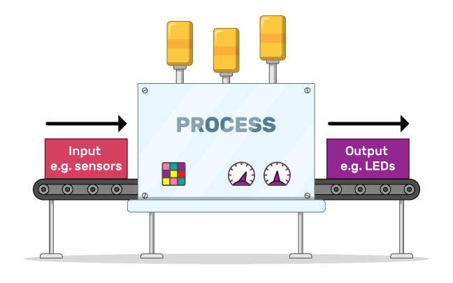
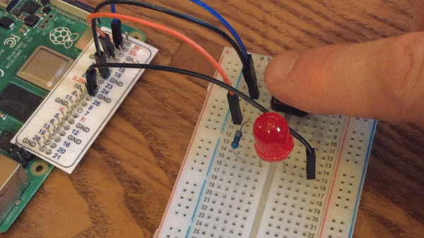
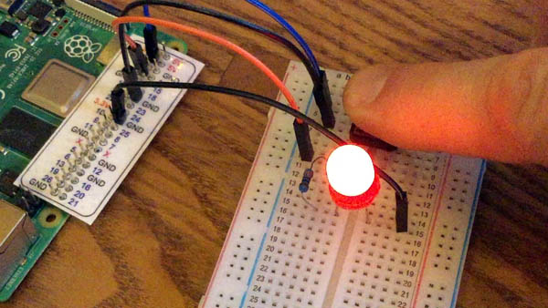
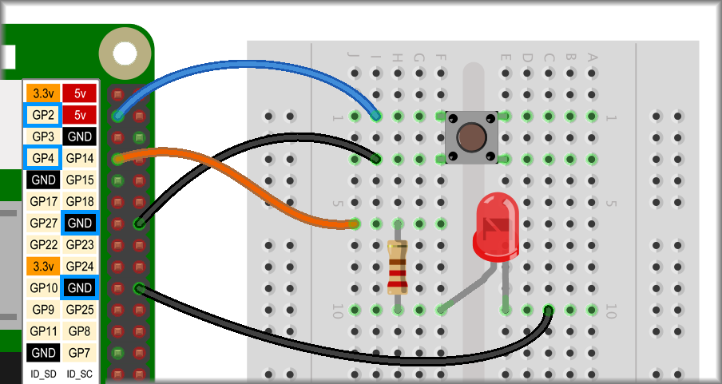

## Controlling an LED

You may remember that button switches are an **input** that sends information to your Pi the moment it is pressed or released, and whether it is currently held down or not held down.

So far, your **output** has been different effects on a Scratch sprite shown visually on a screen.



In the **LEDs, buzzers, and Scratch games** project, you looked at how to control **outputs** such as LEDs. Now you are going to combine your button **input** with an LED **output**.

--- no-print ---

--- /no-print ---

--- print-only ---

--- /print-only ---

### The electronic circuits

Let's start with your simple button setup.


--- task ---

Add an LED connected to GPIO pin 4.



--- /task ---

**NOTE:** The two circuits, one for the button and one for the LED, are completely separate, independent circuits.

### The Scratch program

Now that you have your circuits ready, it is time to write some code in Scratch.

--- task ---

From the `Raspberry Pi Simple Electronics`{:class="block3extensions"} block palette, grab a `when button pressed`{:class="block3extensions"} block and set the button number to `2`{:class="block3extensions"}.

Add another block to `turn LED on`{:class="block3extensions"} and set the LED number to `4`{:class="block3extensions"}.

```blocks3
when button (2 v) is [pressed v] ::hat extension
turn LED (4 v) [on v] ::extension
```

--- /task ---

And to turn the LED off again.

--- task ---

Duplicate the code you just wrote, change the `when button pressed`{:class="block3extensions"} to `when button released`{:class="block3extensions"}, and change the `turn LED 4 on`{:class="block3extensions"} to `turn LED 4 off`{:class="block3extensions"}.


```blocks3
when button (2 v) is [pressed v] ::hat extension
turn LED (4 v) [on v] ::extension

+ when button (2 v) is [released v] ::hat extension
+ turn LED (4 v) [off v] ::extension
```

--- /task ---

NOTE: The `when button pressed`{:class="block3extensions"} and `when button released`{:class="block3extensions"} blocks constantly check if the button is pressed or released. In the background they act like `forever`{:class="block3control"} loops; they constantly check the state of the button.

You can write your own code to do the same thing. Next, you will write code that constantly 'asks' if the button is being pressed and tells the LED to be on or off, depending on the answer.

--- task ---

Throw your previous code away!

Grab a starting event, the `when flag clicked`{:class="block3events"} block.

Underneath that, place a `forever`{:class="block3control"} loop and inside that, place an `if... then... else...`{:class="block3control"} block.

```blocks3
when flag clicked
forever
    if <> then
    else
    end
end
```

--- /task ---

Between the `if`{:class="block3control"} and the `then`{:class="block3control"} goes the condition to be checked.

--- task ---

From the `Raspberry Pi Simple Electronics`{:class="block3extensions"} block palette, take a hexagonal `button is pressed`{:class="block3extensions"} block, place this in the hexagonal space and set the button number to `2`{:class="block3extensions"}.


```blocks3
when flag clicked
forever
    if <button (2 v) is [pressed v]? :: extension +> then
    else
    end
end
```

--- /task ---

After the `then`{:class="block3control"} and after the `else`{:class="block3control"} go the responses to whether `button 2 is pressed`{:class="block3extensions"} or not.

--- task ---

In the first space, after `then`{:class="block3control"}, place a `turn LED 4 on`{:class="block3extensions"} block, and in the second space, after `else`{:class="block3control"}, place a `turn LED 4 off`{:class="block3extensions"} block.

```blocks3
when flag clicked
forever
    if <button (2 v) is [pressed v]? :: extension> then
+          turn LED (4 v) [on v] ::extension 
    else
+          turn LED (4 v) [off v] ::extension    
    end
end
```

Try this out for yourself. It appears to do the same thing as the previous code but it is a little more responsive.

--- /task ---
