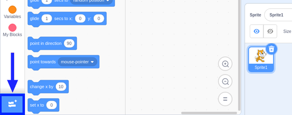
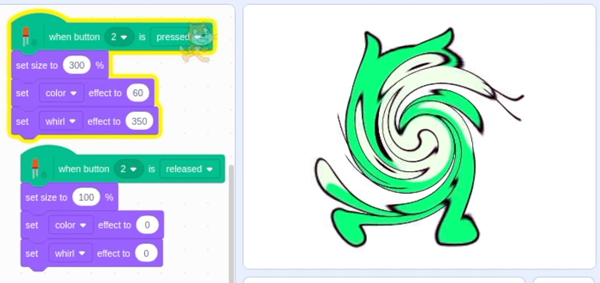
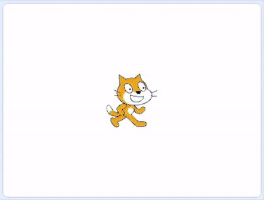

## Controlling an LED

As we looked at earlier, button switches are an **input** that sends information to your Pi about the moment it is pressed or released and whether it is currently held down or not held down.

So far, the only **output** that you have used is effects on a Scratch sprite shown visually on a screen.


In the **LEDs, buzzers and Scratch games** project you looked at controlling **outputs** such as LEDs. Now you are going to combine your button **input** with an LED **output**.

--- no-print ---

--- /no-print ---

--- print-only ---

--- /print-only ---

### The electronic circuits

Let's start with the simple button setup you already have.


--- task ---

Add an LED connected to GPIO pin 4.


--- /task ---

For the button to send an input to your Raspberry Pi using the GPIO pin you will need to add a Scratch extension.

--- task ---

Click on the **Add Extension** button on the bottom left corner.



Scroll down to the bottom to find three Raspberry Pi extensions.


Choose the **Raspberry Pi Simple Electronics** extension. When you click this, a new palette of coding blocks becomes available.


--- /task ---

--- task ---

You would usually start with an **event** from the `Events`{:class="block3events"} palette to start your code, such as `when flag clicked`{:class="block3events"}, but the `Raspberry Pi Simple Electronics`{:class="block3extensions"} palette has an event of its own.

Pick the `when button 0 is pressed`{:class="block3extensions"} block.

```blocks3
when button (0 v) is [pressed v] ::extension
```

--- /task ---

--- task ---

Change the button number to 2 (or whatever GPIO pin you connected your button switch to) and add any effect you like to that, or follow the example below.

```blocks3
when button (2 v) is [pressed v] ::extension
set size to (300) %
```

If you like, you could add a few different effects, like below.

```blocks3
when button (2 v) is [pressed v] ::extension
set size to (300) %
set [color v] effect to (60)
set [whirl v] effect to (350)
```

Press the button and see what happens to Scratch cat.

--- no-print ---

--- /no-print ---

--- print-only ---

--- /print-only ---

--- /task ---

You can also use the button release **event** to set Scratch cat back to normal.

--- task ---

Duplicate the code you just made, set the `button pressed`{:class="block3extensions"} event to `button released`{:class="block3extensions"}, set `size`{:class="block3looks"} to 100%, and `color`{:class="block3looks"} and `whirl`{:class="block3looks"} to 0.

```blocks3
when button (2 v) is [released v] ::extension
set size to (100) %
set [color v] effect to (0)
set [whirl v] effect to (0)
```

Press and release the button to check that it works as you expect.

--- no-print ---

--- /no-print ---

--- print-only ---

--- /print-only ---

--- /task ---

Another option is to use the **SPACE** key as an effect reset `event`{:class="block3events"} instead of the `button released`{:class="block3extensions"} event, and swap the `when button pressed`{:class="block3extensions"} `set`{:class="block3looks"} effects to `change`{:class="block3looks"} effects.

Let's try it out!

--- task ---

First, replace `when button released`{:class="block3extensions"} with `when space pressed`{:class="block3events"}.

```blocks3
when [space v] key pressed
set size to (100) %
set [color v] effect to (0)
set [whirl v] effect to (0)
```
--- /task ---

--- task ---

Next, under the `when button pressed`{:class="block3extensions"} code, replace each of the `set`{:class="block3looks"} blocks with `change`{:class="block3looks"} blocks.

```blocks3
when button (2 v) is [pressed v] ::extension
change size by (50) %
change [color v] effect by (10)
change [whirl v] effect by (50)
```

Press the button a few times and see what happens.

--- no-print ---

--- /no-print ---

--- print-only ---

--- /print-only ---

--- /task ---