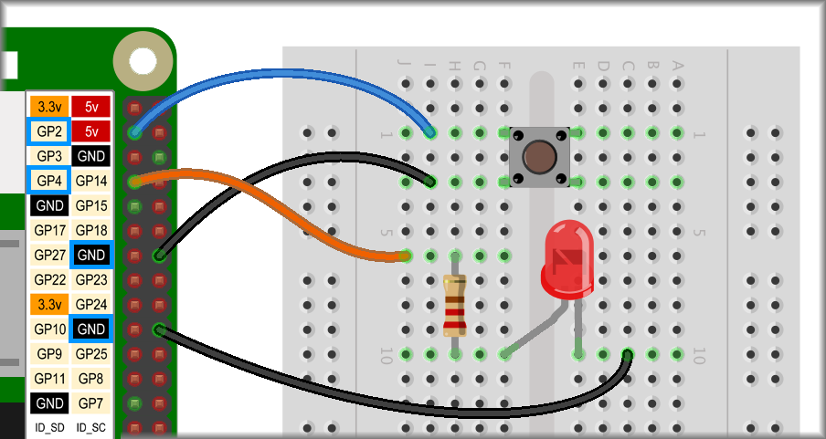

## Controlling an LED sequence

In the last section, **controlling an LED**, you used a button to turn an LED on and off. Now you will use the button to control an LED running a flashing sequence.

You can keep the same hardware setup that you used in **controlling an LED**. If you like, you can easily adapt the project and add extra LEDs or a buzzer.



### Flashing while pressed

For your first sequence control project, you'll code the LED to flash only while the button is pressed.

--- task ---

First, you'll need an event such as the `when flag clicked`{:class="block3events"} block.

Underneath that, place a `forever`{:class="block3control"} loop and inside that, place an `if... then`{:class="block3control"} block.

```blocks3
when flag clicked
forever
    if <> then
    end
end
```

--- /task ---

This set of blocks will continuously check a condition, or ask a question, and then do something if the condition is **true**, i.e. the answer is positive. In this case you want to ask if the button attached to GPIO pin 2 is being pressed.

--- task ---

Add a `Rapsberry Pi`{:class="block3extensions"} **selection** block, that asks if a `button is pressed`{:class="block3extensions"}. Set the button number to `2`{:class="block3extensions"}.

```blocks3
when flag clicked
forever
    if <button (2 v) is [pressed v]?> then
    end
end
```

--- /task ---

Now you need to fill the gap after `then`{:class="block3control"} with what happens if the condition is **true**, i.e. if the button is being pressed.

In this example, the LED will flash, but it could be whatever you like.

--- task ---

Add blocks to `turn LED 4 on`{:class="block3extensions"}, `wait 0.1 seconds`{:class="block3control"} (a tenth of a second), `turn LED 4 off`{:class="block3extensions"} and then `wait`{:class="block3control"} again.

```blocks3
when flag clicked
forever
    if <button (2 v) is [pressed v]?> then
+       turn LED (4 v) [on v] ::extension
+       wait (0.1) seconds
+       turn LED (4 v) [off v] ::extension
+       wait (0.1) seconds
    end
end
```

Click the green flag and press the button. Keep the button pressed and see what happens.

--- /task ---

The code only says to turn the LED on and off when the button is being pressed. However, as long as the button is pressed those instructions repeat themselves and as a result the LED flash.

The last LED instruction is to `turn LED 4 off`{:class="block3extensions"}. Therefore,the LED will always be off when the button is not  pressed.

--- task ---

Reverse the position of the two `turn LED 4 on & off`{:class="block3extensions"} blocks.

Can you see what the effect will be?

```blocks3
when flag clicked
forever
    if <button (2 v) is [pressed v]?> then
+       turn LED (4 v) [off v] ::extension
        wait (0.1) seconds
+       turn LED (4 v) [on v] ::extension
        wait (0.1) seconds
    end
end
```

Click the green flag, press the button and see what has changed.

--- /task ---

### Flashing until pressed

For your second sequence control project, you'll code the LED to flash continuously until the button is pressed.

--- task ---

For this, you'll need to first swap the `if... then...`{:class="block3control"} block for an `if... then... else...`{:class="block3control"} block.

You'll want to reuse most of the code so, without throwing it away, pull out the `button 2`{:class="block3extensions"} condition block and the `turn LED 4 on & off`{:class="block3extensions"} sequence. Arrange the `LED`{:class="block3extensions"} blocks as they were previously so that the `LED turns on`{:class="block3extensions"} first.

Throw the `if... then...`{:class="block3control"} block away and replace it with an `if... then... else...`{:class="block3control"} block.

```blocks3
when flag clicked
forever
+   if <> then
    else
    end
end

<button (2 v) is [pressed v]?> :: extension

turn LED (4 v) [on v] ::extension
wait (0.1) seconds
turn LED (4 v) [off v] ::extension
wait (0.1) seconds
```

--- /task ---

--- task ---

Replace the hexagonal `button 2`{:class="block3extensions"} condition block in the space in the new `if... then... else...`{:class="block3control"} block.

Since this sequence turns the LED off when the button is pressed, place an `turn LED 4 off`{:class="block3extensions"} block after the `then`{:class="block3control"}.

```blocks3
when flag clicked
forever
    if <button (2 v) is [pressed v]?> then
+       turn LED (4 v) [off v] ::extension
    else
    end
end
```

--- /task ---

--- task ---

Finally, place the `turn LED 4 on & off`{:class="block3extensions"} sequence in the space below `else`{:class="block3control"}. This will happen whenever the button is not pressed.

```blocks3
when flag clicked
forever
    if <button (2 v) is [pressed v]?> then
        turn LED (4 v) [off v] ::extension
    else
+       turn LED (4 v) [on v] ::extension
+       wait (0.1) seconds
+       turn LED (4 v) [off v] ::extension
+       wait (0.1) seconds       
    end     
end
```

Click the green flag and see what happens. What happens when you press the button? 

After you release the button, does the LED stay on or off? Can you work out why?

--- /task ---
