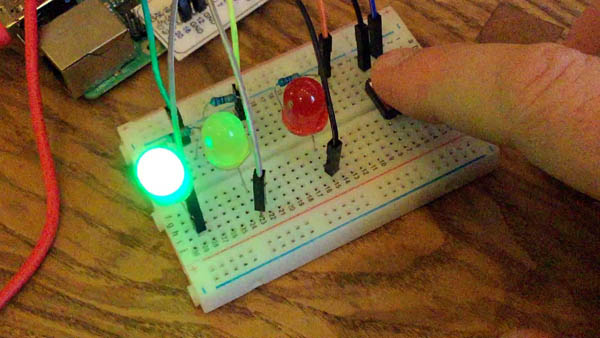
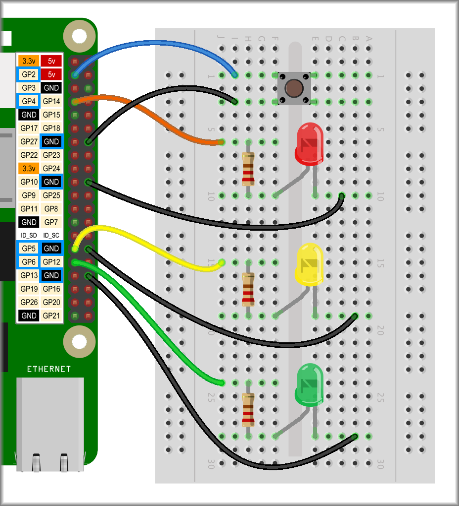
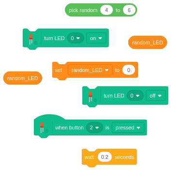

## Challenge: which LED?

For this challenge, you will write a completely new code that will randomly choose one of three LEDs to turn on when you press the button.

--- no-print ---


--- /no-print ---

--- print-only ---



--- /print-only ---

You need to wire up three LEDs (preferably different colours) and a button.



To keep the code simple, connect the LEDs to three consecutive number GPIO pins, e.g. 4, 5, and 6.

NOTE: In addition to using the drop-down box, you can also specify an LED number by dropping in a variable block, as shown below.

```blocks3
turn LED (my variable) [on v] :: extension
```

See if you can use this to make one random LED turn on when you press the button and then, after a moment, turn off again.

--- hints ---

--- hint ---

First, you'll need to create a `variable`{:class="block3variables"} and call it `random_LED`{:class="block3variables"}.

Then write code so that `when you press button 2`{:class="block3extensions"}, `random_LED`{:class="block3variables"} is set to `between 4 and 6`{:class="block3operators"}, a `random_LED`{:class="block3variables"} turns on, the program `waits`{:class="block3control"} for `0.2 seconds`{:class="block3control"} and then the same `random_LED`{:class="block3variables"} turns off again.

--- /hint ---

--- hint ---

Arrange the code blocks below to turn a random LED on and then off again when the button is pressed.



--- /hint ---

--- hint ---

Write your program using the code below.

```blocks3
when button (2 v) is [pressed v] ::hat extension
set [random_effect v] to (pick random (4) to (6))
turn LED (random_LED) [on v] :: extension
wait (0.2) seconds
turn LED (random_LED) [off v] :: extension
```

--- /hint ---

--- /hints ---
